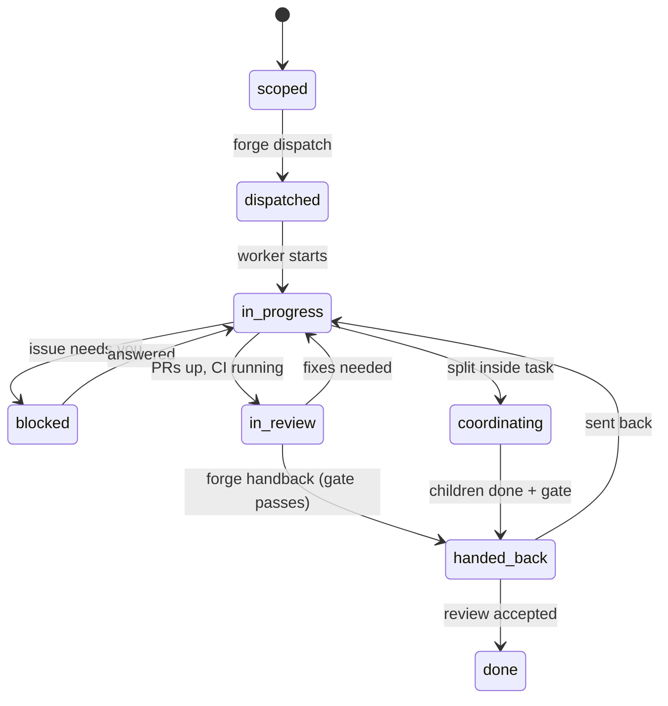

# forge

forge runs a software project as a **tree of tasks**, each owned end-to-end by one long-lived
Claude Code background session (a *worker*). A coordinator session scopes the project with you,
splits it into worker-sized tasks, dispatches workers into their own git worktrees, relays your
comments to them, and reviews what they hand back. Workers plan, build test-first, open draft
(stacked) PRs, drive CI + SonarCloud green, keep ClickUp in sync, document, and hand back only when
a hard **gate** passes.

It is three pieces:

| Piece | What |
|---|---|
| Claude Code plugin (`.claude-plugin/`, `skills/`, `hooks/`) | `forge:*` skills + Stop/SessionStart hooks |
| `forge` CLI (`bin/forge`, `forge_lib/`) | Python 3.12 stdlib; owns all state under `~/agent-projects` |
| Local web UI (`ui/`) | http://localhost:7777 - tasks, PRs, issues, comment inbox, live agent transcripts + messaging |

Builds on the [superpowers](https://github.com/obra/superpowers) plugin (brainstorming,
writing-plans, test-driven-development, requesting/receiving-code-review, ...).

## Architecture

```mermaid
graph LR
  U[You] -- chat --> C[Coordinator session]
  U -- comments --> UI[forge UI :7777]
  UI --> FS[(~/agent-projects<br/>project/task folders)]
  C -- forge CLI --> FS
  C -- forge dispatch: claude --bg --> W1[Worker session<br/>own worktree]
  C -- SendMessage / relay --> W1
  W1 -- forge CLI --> FS
  W1 --> GH[GitHub PRs + CI]
  W1 --> SQ[SonarCloud]
  W1 --> CU[ClickUp subtasks]
  H[Stop / SessionStart hooks] -. gate + briefing .-> W1
```

See [docs/design.md](docs/design.md) for the full design.

## Install

Prereqs: `python3` (3.12+), `git`, `gh` (authenticated), `git-spice`, `claude`.

```bash
git clone <this repo> ~/Downloads/forge
cd ~/Downloads/forge && ./install.sh
```

`install.sh` is idempotent. It checks prereqs, symlinks `bin/forge` to `~/.local/bin/forge`,
creates `~/agent-projects` and a `~/.config/forge/env` template (mode 600), adds this repo as the
local plugin marketplace `forge`, installs `forge@forge`, and installs `superpowers` if missing.
Restart Claude Code afterwards so the skills and hooks load.

### Credentials

Edit `~/.config/forge/env` (never commit it; keep it `chmod 600`):

```bash
CLICKUP_TOKEN=pk_...          # ClickUp personal API token
SONAR_TOKEN=...               # SonarCloud user token
# CLICKUP_TEAM_ID=...         # optional, for adopt-scan/search
```
Environment variables with the same names take precedence. GitHub access goes through `gh`.
`FORGE_HOME` overrides the state directory (default `~/agent-projects`).

## Quick start

1. **Start a project** - in a Claude Code session in your repo: `/forge:start-project`.
   Give the goal, ClickUp parent ticket and repo. It brainstorms scope with you and writes
   `spec.md` + `tests.md` (acceptance tests) for your approval.
2. **Split** - `/forge:split` proposes a task table (size, dependencies, interfaces, tests).
   Approve or edit it.
3. **Dispatch** - `/forge:dispatch` starts up to `max_parallel` workers (default 5):
   each is `claude --bg` in its own worktree named `forge-<project>-<task>`.
   Workers launch with the project's `permission_mode` (`forge init-project --permission-mode`,
   default `auto`); keep it equal to the coordinator's mode, or every message between them is held
   for your approval.
4. **Watch and steer** - the UI **Agents** view (`#/agents`) lists every task and coordinator with its
   session, live state and last activity; each agent page shows the live transcript (refreshing every
   4s) and a "Message this agent" box. From the terminal: `forge agents` and
   `forge send <key> "<text>"` (live sessions get it via SendMessage within seconds, idle ones are
   resumed with it; the message is also recorded in the task inbox). Background workers can be attached
   with `claude attach <bg-id>` (the Agents view has "Open in Terminal").
5. **Relay loop** - in the coordinator session run `/loop 5m /forge:relay`: it delivers any message
   the direct path could not (bridge failures) and surfaces handbacks/blocked tasks.
6. **UI** - `forge ui` then open http://localhost:7777: project tree, PR/CI/Sonar status,
   issues with mermaid diagrams, and a comment box per task/issue.
7. **Review** - when a task is handed back: `/forge:review-handback` accepts it (`done`, ClickUp
   updated, dependents unblocked) or sends it back with notes.
8. **Status** any time: `/forge:status`.

**Adopt an existing project** (ticket with subtasks, open PRs, running sessions):
`/forge:adopt-project` runs `forge adopt-scan`, proposes a task mapping, imports PRs, drafts specs
for confirmation, and can make existing sessions the owners of their tasks.

## Task lifecycle



| State | Meaning | Set by |
|---|---|---|
| `scoped` | spec + tests written, not started | `split` / `new-task` |
| `dispatched` | worker session started or resumed | `forge dispatch` |
| `in-progress` | worker implementing | worker |
| `blocked` | waiting on you (an issue is open) | worker, or Stop hook after 5 blocks |
| `in-review` | PRs open, driving CI/Sonar/reviews green | worker |
| `coordinating` | task split; its worker coordinates children | `split` |
| `handed-back` | gate passed, awaiting coordinator review | `forge handback` only |
| `done` | accepted | coordinator |
| `cancelled` | dropped | anyone |

**Gate** (`forge gate <key>`): every test green (or skipped with a reason), >= 1 PR, every PR's
checks green with zero unresolved threads and Sonar OK, no open inbox messages, no unfinished
children. The Stop hook keeps a worker going while its inbox has unacked messages or while it is
`in-review` with a failing gate (max 5 consecutive blocks, then it marks the task `blocked`).

## Skills

| Skill | Who | Purpose |
|---|---|---|
| `forge:start-project` | coordinator | scope, spec.md + tests.md, approval |
| `forge:split` | coordinator / worker | worker-sized tasks with interfaces + tests |
| `forge:dispatch` | coordinator | start/resume workers within `max_parallel` |
| `forge:status` | anyone | concise tree/PR/session report |
| `forge:relay` | coordinator (loop) | inbox -> workers, surface handbacks |
| `forge:review-handback` | coordinator | accept or send back |
| `forge:work` | worker | the end-to-end task loop |
| `forge:clickup-task` | worker | ClickUp subtask + status sync |
| `forge:stacked-prs` | worker | git-spice stacks |
| `forge:ci-sonar-gate` | worker | CI + Sonar + threads until gate passes |
| `forge:write-issue` | worker | structured asks to you (+ optional artifact) |
| `forge:adopt-project` | coordinator | import ongoing work |

## Files

State lives in `~/agent-projects/<slug>/` (`project.json`, `spec.md`, `tests.md`,
`tasks/<ID>-<slug>/{task.json,spec.md,tests.json,prs.json,issues/,inbox.json,log.md}`).
See `CONTRACT.md` for the exact schemas and CLI.
