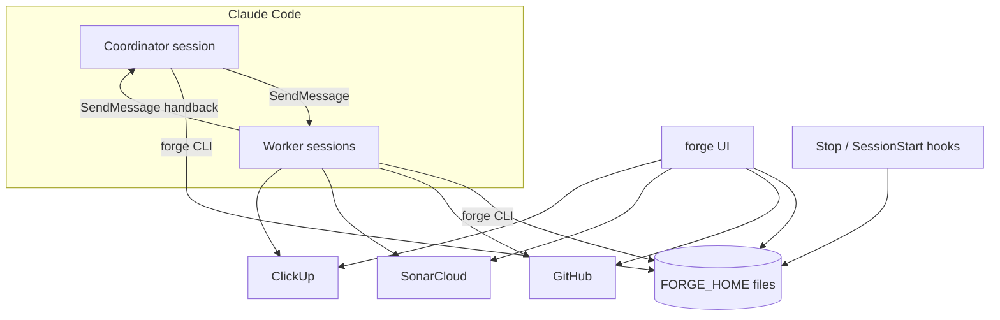
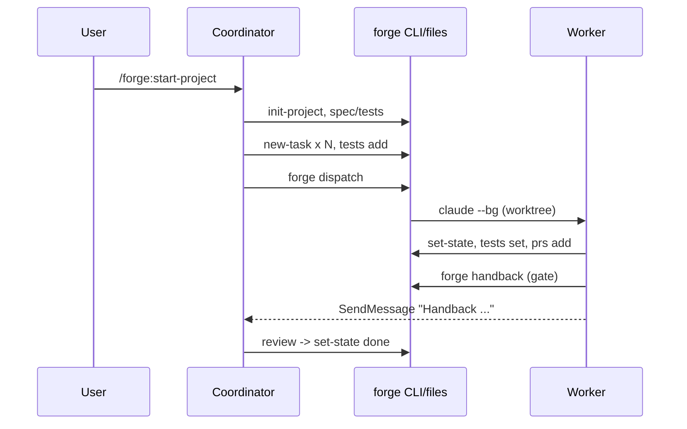
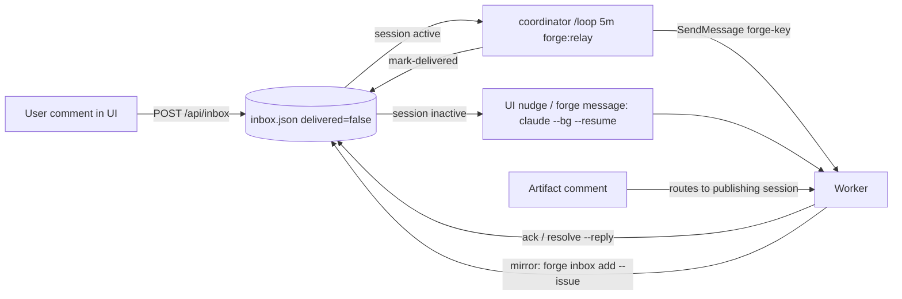

# forge design

forge turns a project into a tree of tasks, each owned by one long-lived Claude Code background
session. State is plain files under `$FORGE_HOME` (default `~/agent-projects`); every actor
(coordinator, workers, hooks, UI) reads and writes it through the `forge` CLI / `forge_lib`.
`CONTRACT.md` is the binding spec for schemas and commands; this doc explains how the pieces fit.

## Components

| Component | Where | Responsibility |
|---|---|---|
| `forge` CLI | `bin/forge`, `forge_lib/` | all state mutations (atomic json + rendered md), dispatch, gate, hooks, integrations |
| Integrations | `forge_lib/integrations/` | GitHub (`gh api graphql`), SonarCloud, ClickUp REST |
| Plugin skills | `skills/*/SKILL.md` | procedures for coordinator and worker (`forge:*`) |
| Hooks | `hooks/hooks.json` | `Stop` -> `forge hook stop` (gate/inbox enforcement); `SessionStart` -> briefing |
| UI | `ui/server.py` + `ui/static/` | localhost:7777 dashboard, PR/issue views, comment inbox |
| Claude Code | `claude --bg`, `claude attach`, `claude agents`, SendMessage | session runtime + live messaging |

## Lifecycle

1. **Scope** (`forge:start-project`): coordinator + user brainstorm; `project.md`, `spec.md`,
   `tests.md` (acceptance tests) approved by the user.
2. **Split** (`forge:split`): tasks sized for one context (<= 3 stacked PRs, <= ~15 files, 1-2
   modules, <= 2-page spec, independently testable) with explicit interfaces and `depends_on`;
   tests seeded via `forge tests add`. User approves the distribution table.
3. **Dispatch** (`forge:dispatch`): `forge dispatch` starts
   `claude --bg -n forge-<key> -w forge-<key>` (real session id recorded from `claude agents --json`) in the task repo, honoring
   `depends_on` and `max_parallel` (default 5). The deterministic session id makes resume idempotent.
4. **Work** (`forge:work`): ClickUp subtask, branch `<ID>-<desc>`, plan, TDD with test status
   red -> green + evidence, docs, draft PRs (single or git-spice stack), CI/Sonar loop, inbox handling,
   issues when the user is needed.
5. **Handback**: `forge handback` runs the gate; on pass -> `handed-back`; the worker SendMessages its
   owner (parent task's session, else project coordinator).
6. **Review** (`forge:review-handback`): coordinator accepts (`done`, ClickUp updated, dependents
   become `ready`) or sends back through the inbox.

## Nesting

A worker whose task proves too big runs `forge:split` on its own key: children live in
`<task>/tasks/`, the task becomes `coordinating`, and **the same session stays the owner** - it
dispatches, relays and reviews its children exactly like the project coordinator. Its gate
additionally requires every child to be `handed-back|done|cancelled`. Handback notifications always
go one level up (parent task's session, else project coordinator), so each owner only talks to its
direct children.

## The gate

`forge gate <key>` (also run by `forge handback`, and by the Stop hook when `in-review`):

| Check | Passes when |
|---|---|
| Tests | >= 1 test; all `green`, or `skipped` with `skip_reason` |
| PRs | >= 1 PR; each: checks `SUCCESS`, 0 unresolved threads, Sonar `OK` if a key is set (`NONE` fails "sonar pending"); drafts allowed |
| Inbox | no open user/coordinator messages |
| Children | none outside `handed-back|done|cancelled` |

The Stop hook turns the gate into a loop: a worker cannot end its turn while it has unacked inbox
messages, or while `in-review` with a failing gate. To avoid infinite loops it blocks at most 5
consecutive times, then allows the stop and marks the task `blocked`.

## Comment -> agent loop

- The inbox (`inbox.json`) is the source of truth; `delivered` tracks transport, `status`
  (`open -> acked -> resolved`) tracks handling.
- Inactive sessions are reached by resume (`claude --bg --resume <uuid> "<msg>"`).
- Active sessions cannot be injected into from outside Claude Code; only another session's
  SendMessage reaches them, hence the coordinator relay loop. `forge dispatch/message` on an active
  session exits 3 and leaves the message undelivered for the relay.
- Issues can be published as Artifacts from the worker's own session so artifact comments route to
  that worker; the worker mirrors them into the inbox so the UI stays complete.
- The SessionStart hook replays open inbox items, issues, PRs and gate reasons into context on
  startup/resume/compact, so nothing depends on the worker remembering.

## Known limitations

- **SendMessage is point-to-point** and only available inside a Claude Code session: the UI and CLI
  cannot message a live session. Delivery to active-but-idle workers waits for the next relay pass
  (default 5 min) and requires the coordinator session to be running its `/loop`.
- **No coordinator, no live relay**: if the coordinator session is gone, active workers only see
  new comments when they check the inbox themselves or when they go inactive and get resumed.
- **Worktrees are not cleaned up** automatically; remove them after merge
  (`git worktree list` / `git worktree remove`).
- **Token cost**: each worker is a full session; nested splits multiply this. `max_parallel`
  bounds concurrency per project, not globally.
- **Plugin copy**: Claude Code installs the plugin into its cache, so hooks run the cached
  `bin/forge`; after pulling changes run `claude plugin update forge@forge` (the `~/.local/bin/forge`
  symlink points at the repo and is always current).
- **Hooks fire in every session** with the plugin enabled; `forge hook *` exits silently when the
  session is not mapped to a task.
- ClickUp status names vary per list; skills map to the closest status and fall back to comments.
- Gate freshness depends on `forge prs refresh`; GitHub/Sonar rate limits apply.

## Agents: watching and messaging sessions

Every task with `task.session` (and each project's `coordinator_session`) is a real Claude Code session.
`forge_lib/agents.py` joins them with `claude agents --json` (match by session id, then by name) and
reads their transcripts from `~/.claude/projects/<cwd with non-alphanumerics -> '-'>/<sessionId>.jsonl`
(fallback: newest `*/<sessionId>.jsonl`, since resumed sessions can move directories). Only the tail is
read, backwards in 64 KB chunks (capped at 8 MB).

There is no CLI to inject input into a live session, so delivery uses a bridge: a one-shot
`claude -p --model haiku --allowedTools SendMessage ListAgents` (prompt on stdin; the message is
fenced by a random marker) run in the task repo, which answers `SENT` or `FAILED: <reason>`.
`agents.send` records the message in the inbox first, then: live -> bridge; not live -> resume with the
message; bridge failure -> left undelivered for `forge:relay`. The delivered text names the inbox id so
the worker can ack/resolve it (the Stop hook blocks until it does).

Known limits: the bridge costs a small model call and ~10 s per message; cross-session rows in a
transcript show the bridge's own ephemeral session as sender; interactive sessions (e.g. a coordinator
started in a terminal) cannot be attached, only messaged.
